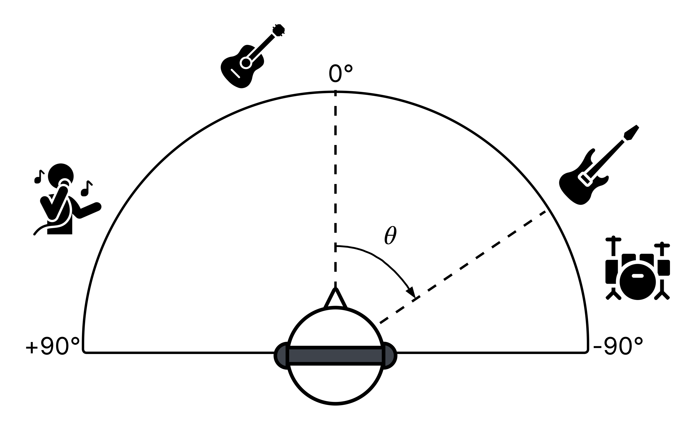
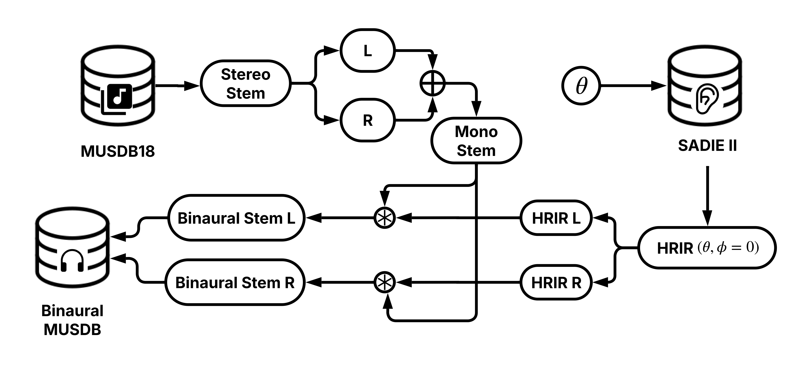

# Binaural Musical Source Separation (MSS)

The accompanying repository for **"Do Music Source Separation Models Preserve Spatial Information in Binaural Audio?"** 
by Richa Namballa, Dr. Agnieszka Roginska, and Dr. Magdalena Fuentes.
> Binaural audio remains underexplored within the music information retrieval community. Motivated by the rising popularity of virtual and augmented reality experiences as well as potential applications to accessibility, we investigate how well existing music source separation (MSS) models perform on binaural audio. Although these models process two-channel inputs, it is unclear how effectively they retain spatial information. In this work, we evaluate how several popular MSS models preserve spatial information on both standard stereo and novel binaural datasets. Our binaural data is synthesized using stems from MUSDB18-HQ and open-source head-related transfer functions by positioning instrument sources randomly along the horizontal plane. We then assess the spatial quality of the separated stems using signal processing and interaural cue-based metrics. Our results show that stereo MSS models fail to preserve  the spatial information critical for maintaining the immersive quality of binaural audio, and that the degradation depends on model architecture as well as the target instrument. Finally, we highlight valuable opportunities for future work at the intersection of MSS and immersive audio.


## Binaural-MUSDB

<center></center>

To perform binaural synthesis, first download [MUSDB18-HQ](https://zenodo.org/records/3338373) and the Head-Related Impulse Responses (HRIRs) for Subject D1 (44.1kHz, 16-bit WAV) from [SADIE II](https://www.york.ac.uk/sadie-project/database.html).

<center></center>

**For randomly placed sources**:

```
python binaural_synth.py \
        /path/to/musdbhq18
        /path/to/output/directory
        /path/to/hrir/directory
```

**Example usage to reproduce Binaural-MUSDB**:

```
python binaural_synth.py \
        data/musdb18hq
        data/binaural_musdb18
        data/D1_HRIR_WAV/44K_16bit
        data/binaural_musdb_metadata.json
```


## Experiments
### Inference

To run inference on either MUSDB18-HQ or Binaural-MUSDB:

**HT Demucs (FT)**
```
python inference/demucs.py \
        /path/to/input/data/split
        -o /path/to/output/directory
```

**Open-Unmix**
```
python inference/open_umx.py \
        /path/to/input/data/split
        -o /path/to/output/directory
```

**Spleeter**
```
python inference/spleeter.py \
        /path/to/input/data/split
        -o /path/to/output/directory
```

**Example Usage**
```
python inference/demucs.py \
        data/binaural_musdb18/test
        -o data/output/htdemucs_ft/binaural/test
```

### Evaluation

To evaluate the models' performances, we compute the Signal to Spatial Distortion Ratio (SSR) and Signal to Residual Distortion (SRR) ratios in `spauq_metrics.ipynb`. The Interaural Time Difference (ITD) and Interauaral Level Difference (ILD), as well as their $\Delta$ values, are calculated in `interaural_metrics.ipynb`.

The summary statistics are available in `table_analysis.ipynb`. Plots can be replicated in `plot_analysis.ipynb` but you must run `metadata.ipynb` to aggregate the angle metadata first.

## BibTeX Citation

```
@inproceedings{Namballa2025,
  title = {Do Music Source Separation Models Preserve Spatial Information in Binaural Audio?},
  author = {Namballa, Richa and Roginska, Agnieszka and Fuentes, Magdalena},
  booktitle = {Proceedings of the 26th International Society for Music Information Retrieval Conference},
  year = {2025},
  address = {Daejeon, South Korea},
  organization = {ISMIR}
}
```

## References

[1] Z. Rafii, A. Liutkus, F.-R. Stöter, S. I. Mimilakis, and R. Bittner, "MUSDB18-HQ - an uncompressed version of MUSDB18," Dec. 2019. [Online]. Available: https://doi.org/10.5281/zenodo.3338373

[2] C. Armstrong, L. Thresh, D. Murphy, and G. Kearney, "A perceptual evaluation of individual and non-individual HRTFs: A case study of the SADIE II database," _Applied Sciences_, vol. 8, no. 11, p. 2029, 2018.

[3] S. Rouard, F. Massa, and A. Défossez, "Hybrid transformers for music source separation," in _2023 IEEE International Conference on Acoustics, Speech and Signal Processing (ICASSP)_. IEEE, 2023, pp. 1–5.

[4] F.-R. Stöter, S. Uhlich, A. Liutkus, and Y. Mitsufuji, "Open-Unmix - a reference implementation for music source separation," _Journal of Open Source Software_,
vol. 4, no. 41, p. 1667, 2019. [Online]. Available: https://doi.org/10.21105/joss.01667

[5] R. Hennequin, A. Khlif, F. Voituret, and M. Moussallam, "Spleeter: a fast and efficient music source separation tool with pre-trained models," _Journal of Open Source Software_, vol. 5, no. 50, p. 2154, 2020.

[6] K. N. Watcharasupat and A. Lerch, "Quantifying spatial audio quality impairment," in _2024 IEEE International Conference on Acoustics, Speech and Signal Processing (ICASSP)_. IEEE, 2024, pp. 746–750.

[7] B. Veluri, M. Itani, J. Chan, T. Yoshioka, and S. Gollakota, “Semantic hearing: Programming acoustic scenes with binaural hearables,” in _Proceedings of the
36th Annual ACM Symposium on User Interface Software and Technology_, 2023, pp. 1–15.